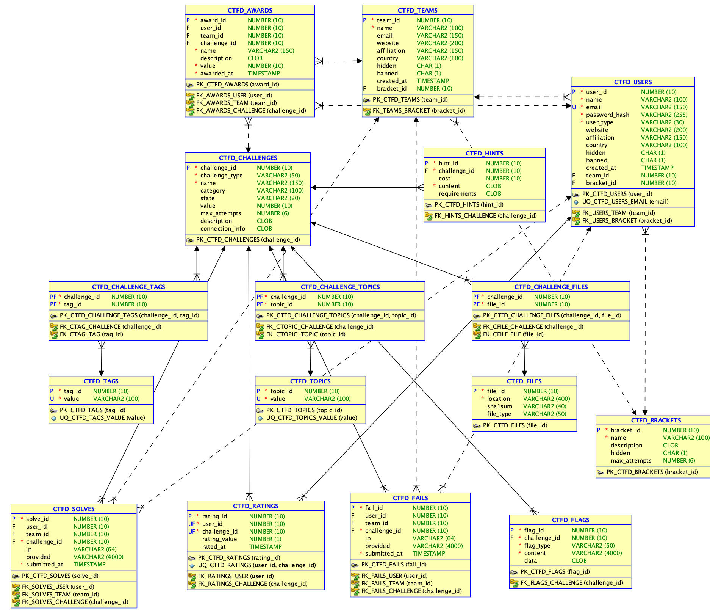
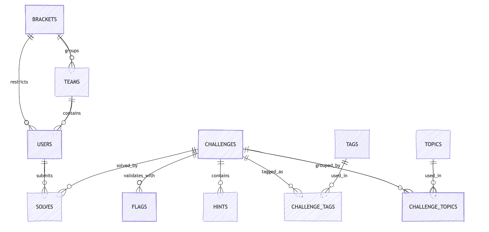
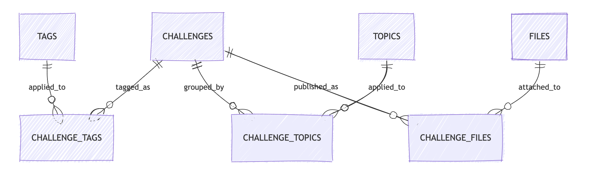
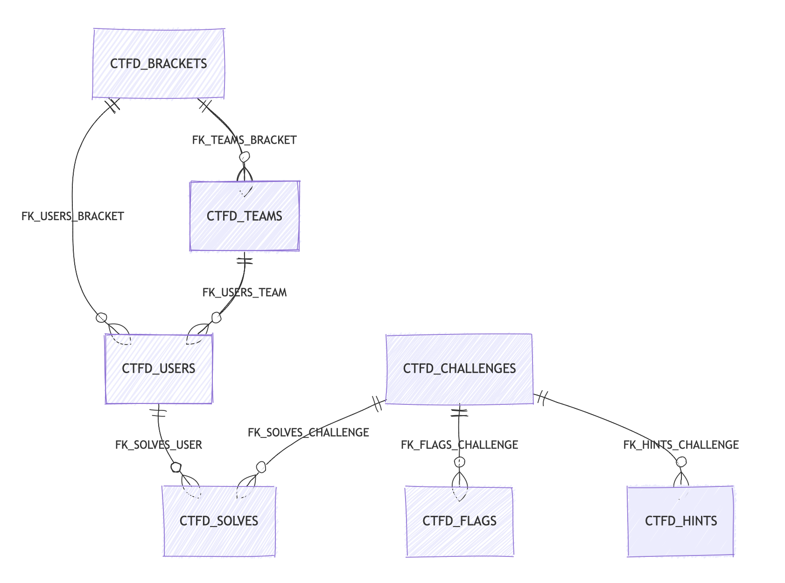

# Курсовой проект по базам данных на основе CTFd

## Основание для выбора предметной области
За основу взята база данных моего проекта платформы для проведения тасковых CTF соревнований. Кратко опишу структуру ее базы данных

## 1. Определение сущностей логической модели

### Выделенные сущности
- `BRACKETS`
- `TEAMS`
- `USERS`
- `CHALLENGES`
- `FLAGS`
- `HINTS`
- `TAGS`
- `CHALLENGE_TAGS`
- `TOPICS`
- `CHALLENGE_TOPICS`
- `FILES`
- `CHALLENGE_FILES`
- `SOLVES`
- `FAILS`
- `AWARDS`
- `RATINGS`

### Краткое обоснование
- `USERS` и `TEAMS` описывают участников соревнования
- `BRACKETS` задают группы или дивизионы
- `CHALLENGES` описывают задания
- `FLAGS` и `HINTS` относятся к механике проверки и помощи
- `TAGS`, `TOPICS`, `FILES` и их ассоциативные таблицы обеспечивают классификацию и публикацию материалов задания
- `SOLVES` и `FAILS` фиксируют попытки сдачи
- `AWARDS` и `RATINGS` отражают систему поощрений и обратной связи

## 2. Проектирование отношений в логической модели

### Основные отношения
- один `BRACKET` содержит много `TEAMS`
- один `BRACKET` ограничивает много `USERS`
- одна `TEAM` содержит много `USERS`
- один `CHALLENGE` имеет много `FLAGS`
- один `CHALLENGE` имеет много `HINTS`
- один `CHALLENGE` связан со многими `TAGS` через `CHALLENGE_TAGS`
- один `CHALLENGE` связан со многими `TOPICS` через `CHALLENGE_TOPICS`
- один `CHALLENGE` связан со многими `FILES` через `CHALLENGE_FILES`
- один `USER` и одна `TEAM` могут иметь много `SOLVES` и `FAILS`
- один `CHALLENGE` может иметь много `SOLVES`, `FAILS`, `AWARDS` и `RATINGS`

### Ключевые идентификаторы
- `bracket_id`
- `team_id`
- `user_id`
- `challenge_id`
- `flag_id`
- `hint_id`
- `tag_id`
- `topic_id`
- `file_id`
- `solve_id`
- `fail_id`
- `award_id`
- `rating_id`

## 3. Нормализация выбранного фрагмента

Для демонстрации нормализации рассмотрим исходную ненормализованную таблицу `Challenge_Submission_Report`:

| User Name | Team Name | Bracket Name | Challenge Name | Category | Tag List | Topic List | File List | Submitted Flag | Result | Award Value |
|---|---|---|---|---|---|---|---|---|---|---|
| alice | redteam | students | SQL 101 | web | sql,basic | intro,db | task.pdf | CTF{...} | solve | 100 |

### Проблемы ненормализованной формы
- повторяющиеся списки тегов, тем и файлов
- дублирование данных о пользователе, команде и брекете
- смешение справочной информации о задании и событий отправки

### Первая нормальная форма
Для 1НФ нужно убрать составные списки и сделать значения атомарными. Это приводит к дроблению строк и росту дублирования.

### Вторая нормальная форма
Для 2НФ нужно отделить данные, зависящие только от части составного ключа:
- данные пользователя вынести в `USERS`
- данные команды вынести в `TEAMS`
- данные брекета вынести в `BRACKETS`
- данные задания вынести в `CHALLENGES`

### Третья нормальная форма
Для 3НФ дополнительно выносятся классификаторы и связи:
- `TAGS`
- `TOPICS`
- `FILES`
- `CHALLENGE_TAGS`
- `CHALLENGE_TOPICS`
- `CHALLENGE_FILES`

В результате модель приводится к корректной форме, где каждый неключевой атрибут зависит только от ключа, полного ключа и ничего кроме ключа.

## 4. Преобразование к третьей нормальной форме

Итоговый нормализованный фрагмент содержит:
- справочники: `BRACKETS`, `TAGS`, `TOPICS`, `FILES`
- основные сущности: `TEAMS`, `USERS`, `CHALLENGES`
- зависимые сущности: `FLAGS`, `HINTS`
- ассоциативные сущности: `CHALLENGE_TAGS`, `CHALLENGE_TOPICS`, `CHALLENGE_FILES`
- события: `SOLVES`, `FAILS`, `AWARDS`, `RATINGS`

## 5. Преобразование отношений многие-ко-многим

В модели CTFd есть несколько отношений `M:N`, которые для реляционной реализации должны быть разложены на отдельные ассоциативные таблицы.

### CHALLENGES и TAGS
- логически: одно задание имеет много тегов, один тег используется у многих заданий
- реализация: `CHALLENGE_TAGS(challenge_id, tag_id)`

### CHALLENGES и TOPICS
- логически: одно задание относится ко многим темам, одна тема используется у многих заданий
- реализация: `CHALLENGE_TOPICS(challenge_id, topic_id)`

### CHALLENGES и FILES
- логически: одно задание публикует несколько файлов, один файл теоретически может быть переиспользован
- реализация: `CHALLENGE_FILES(challenge_id, file_id)`

### USERS и CHALLENGES через факт прохождения
- логически: пользователь может решить много заданий, задание может быть решено многими пользователями
- реализация: `SOLVES`

### USERS и CHALLENGES через неудачную попытку
- реализация: `FAILS`

## 6. Построение модели в SQL Developer Data Modeler

## 7. Определение типов данных и доменов

### Домены
- `id_10` -> `NUMBER(10)`
- `name_100` -> `VARCHAR2(100)`
- `email_150` -> `VARCHAR2(150)`
- `flag_text` -> `VARCHAR2(4000)`
- `long_text` -> `CLOB`
- `bool_yn` -> `CHAR(1)` с ограничением `Y/N`

### Примеры назначения доменов
- все PK и FK идентификаторы используют `id_10`
- названия команд, заданий, тегов и тем используют `name_100`
- описание задания, подсказки и требования используют `long_text`
- поля `hidden` и `banned` используют `bool_yn`

## 8. Реляционная модель

Ниже приведен итог по основным таблицам:

### Блок аккаунтов
- `CTFD_BRACKETS`
- `CTFD_TEAMS`
- `CTFD_USERS`

### Блок заданий
- `CTFD_CHALLENGES`
- `CTFD_FLAGS`
- `CTFD_HINTS`
- `CTFD_TAGS`
- `CTFD_CHALLENGE_TAGS`
- `CTFD_TOPICS`
- `CTFD_CHALLENGE_TOPICS`
- `CTFD_FILES`
- `CTFD_CHALLENGE_FILES`

### Блок активности
- `CTFD_SOLVES`
- `CTFD_FAILS`
- `CTFD_AWARDS`
- `CTFD_RATINGS`

## Cхемы
### Концептуальная схема

### Нормализованный фрагмент

### Реляционная схема

## Вывод
На основе CTFd была построена и нормализована ее база данных: проведено выделение сущностей, проектирование связей, нормализация, устранение `M:N`, назначение типов данных, формирование реляционной модели и подготовка SQL-кода для развертывания в Oracle SQL Developer.
