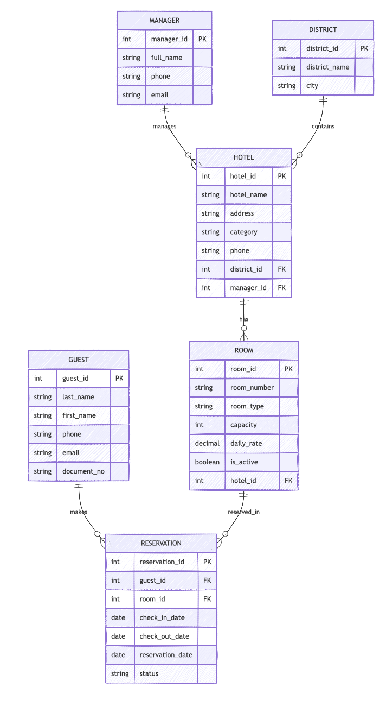

# Практическая работа №1. Определение сущностей логической модели

## Предметная область
Бизнес-процесс: управление отелями.

## 1. Существительные из описания
- районный менеджер
- отель
- район
- место расположения
- город
- номер
- гость
- дата
- свободный номер
- цена номера
- резервирование

## 2. Все ли существительные важны для логической модели
Нет. Для модели нужны только те существительные, по которым требуется хранить данные и выполнять запросы. Например, имя менеджера "Шарон Фергюсон" не является отдельной сущностью само по себе, но приводит к сущности `MANAGER`. Формулировки вроде "свободный номер" не являются сущностью, это состояние номера на определенную дату, которое определяется через бронирование.

## 3. Значимые сущности
- `MANAGER` — районный менеджер, отвечающий за несколько отелей
- `DISTRICT` — район, в котором расположены отели
- `HOTEL` — отель
- `ROOM` — номер в отеле
- `GUEST` — гость
- `RESERVATION` — факт бронирования номера гостем на дату или период

## 4. Имена сущностей
- `MANAGER`
- `DISTRICT`
- `HOTEL`
- `ROOM`
- `GUEST`
- `RESERVATION`

## 5. Важная информация по сущностям

### MANAGER
- идентификатор менеджера
- ФИО менеджера
- телефон
- email

### DISTRICT
- идентификатор района
- наименование района
- город

### HOTEL
- идентификатор отеля
- название отеля
- адрес
- категория
- телефон
- идентификатор района
- идентификатор менеджера

### ROOM
- идентификатор номера
- номер комнаты
- тип номера
- вместимость
- цена за сутки
- статус активности
- идентификатор отеля

### GUEST
- идентификатор гостя
- ФИО гостя
- телефон
- email
- номер документа

### RESERVATION
- идентификатор бронирования
- идентификатор гостя
- идентификатор номера
- дата заезда
- дата выезда
- дата бронирования
- статус бронирования

## 6. Схематичное представление сущностей с атрибутами

### MANAGER
- `manager_id` PK
- `full_name`
- `phone`
- `email`

### DISTRICT
- `district_id` PK
- `district_name`
- `city`

### HOTEL
- `hotel_id` PK
- `hotel_name`
- `address`
- `category`
- `phone`
- `district_id` FK
- `manager_id` FK

### ROOM
- `room_id` PK
- `room_number`
- `room_type`
- `capacity`
- `daily_rate`
- `is_active`
- `hotel_id` FK

### GUEST
- `guest_id` PK
- `last_name`
- `first_name`
- `phone`
- `email`
- `document_no`

### RESERVATION
- `reservation_id` PK
- `guest_id` FK
- `room_id` FK
- `check_in_date`
- `check_out_date`
- `reservation_date`
- `status`

## Итоговая схема

