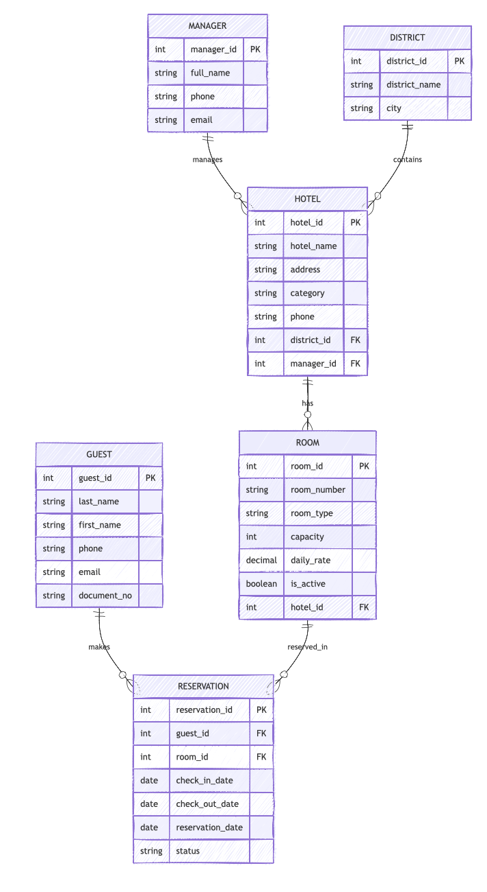
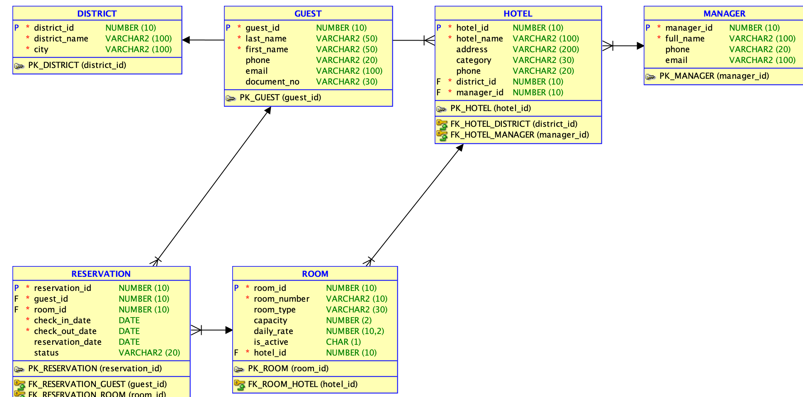

# Практическая работа №2. Проектирование отношений в логической модели

## Основа
Ниже приведено решение на основе сущностей из практической работы №1:
`MANAGER`, `DISTRICT`, `HOTEL`, `ROOM`, `GUEST`, `RESERVATION`.

## 1. Матрица отношений

| Сущность 1 | Сущность 2 | Отношение | Обоснование |
|---|---|---|---|
| MANAGER | HOTEL | 1:M | Один менеджер отвечает за несколько отелей |
| DISTRICT | HOTEL | 1:M | В одном районе расположено несколько отелей |
| HOTEL | ROOM | 1:M | В одном отеле много номеров |
| GUEST | RESERVATION | 1:M | Один гость может сделать много бронирований |
| ROOM | RESERVATION | 1:M | Один номер может фигурировать во многих бронированиях в разные даты |

Прямых обязательных отношений `MANAGER–DISTRICT`, `GUEST–HOTEL` и `GUEST–ROOM` в модели не требуется, потому что они уже выводятся через `HOTEL` и `RESERVATION`.

## 2. Графическое представление отношений

## 2.1 Схема в SQL Developer

## 3. Уникальные идентификаторы
- `MANAGER.manager_id`
- `DISTRICT.district_id`
- `HOTEL.hotel_id`
- `ROOM.room_id`
- `GUEST.guest_id`
- `RESERVATION.reservation_id`

