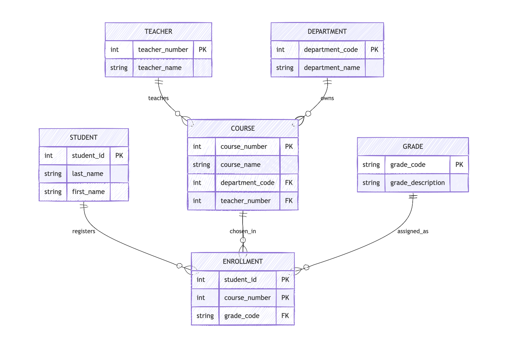
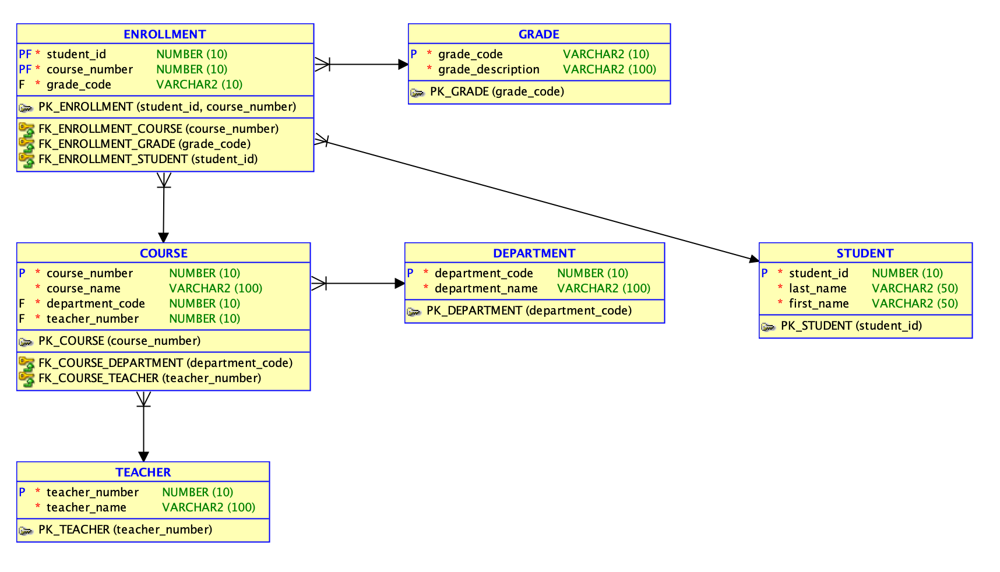

# Практическая работа №3. Нормализация ER-диаграммы

## Исходная диаграмма COURSES

### STUDENT
- `Student ID`
- `Last Name`
- `First Name`

### ENROLLMENT
- `Grade Code`
- `Teacher Number`
- `Grade Description`
- `Course Name`

### COURSE
- `Course Number`
- `Course Name`
- `Teacher Number`
- `Department Code`
- `Department Name`
- `Teacher Name`

## 1. Атрибуты, которые необходимо удалить из сущностей

### Из ENROLLMENT
- `Teacher Number`
- `Grade Description`
- `Course Name`

### Из COURSE
- `Department Name`
- `Teacher Name`

## 2. Какое правило нормализации нарушено

### ENROLLMENT.Teacher Number
Нарушение 2НФ. В сущности учета записи на курс этот атрибут зависит от курса, а не от полного ключа записи на курс.

### ENROLLMENT.Grade Description
Нарушение 3НФ. Описание оценки зависит от `Grade Code`, то есть от неключевого атрибута.

### ENROLLMENT.Course Name
Нарушение 2НФ. Название курса определяется номером курса, а не фактом записи студента на курс.

### COURSE.Department Name
Нарушение 3НФ. Название кафедры зависит от `Department Code`, а не напрямую от ключа курса.

### COURSE.Teacher Name
Нарушение 3НФ. Имя преподавателя зависит от `Teacher Number`, а не от ключа курса.

## 3. Нормализованная модель

### STUDENT
- `student_id` PK
- `last_name`
- `first_name`

### COURSE
- `course_number` PK
- `course_name`
- `department_code` FK
- `teacher_number` FK

### ENROLLMENT
- `student_id` PK, FK
- `course_number` PK, FK
- `grade_code` FK

### GRADE
- `grade_code` PK
- `grade_description`

### TEACHER
- `teacher_number` PK
- `teacher_name`

### DEPARTMENT
- `department_code` PK
- `department_name`

## Итоговая схема отношений

