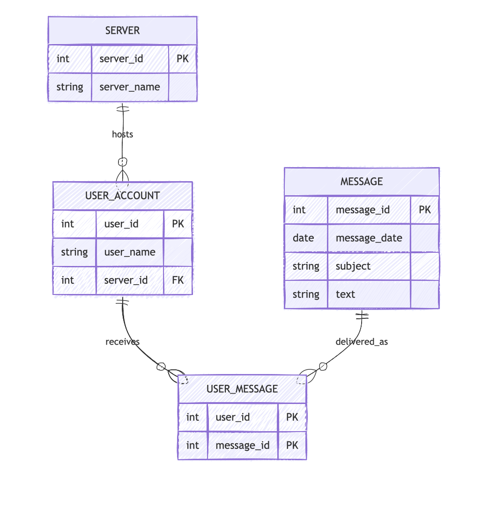
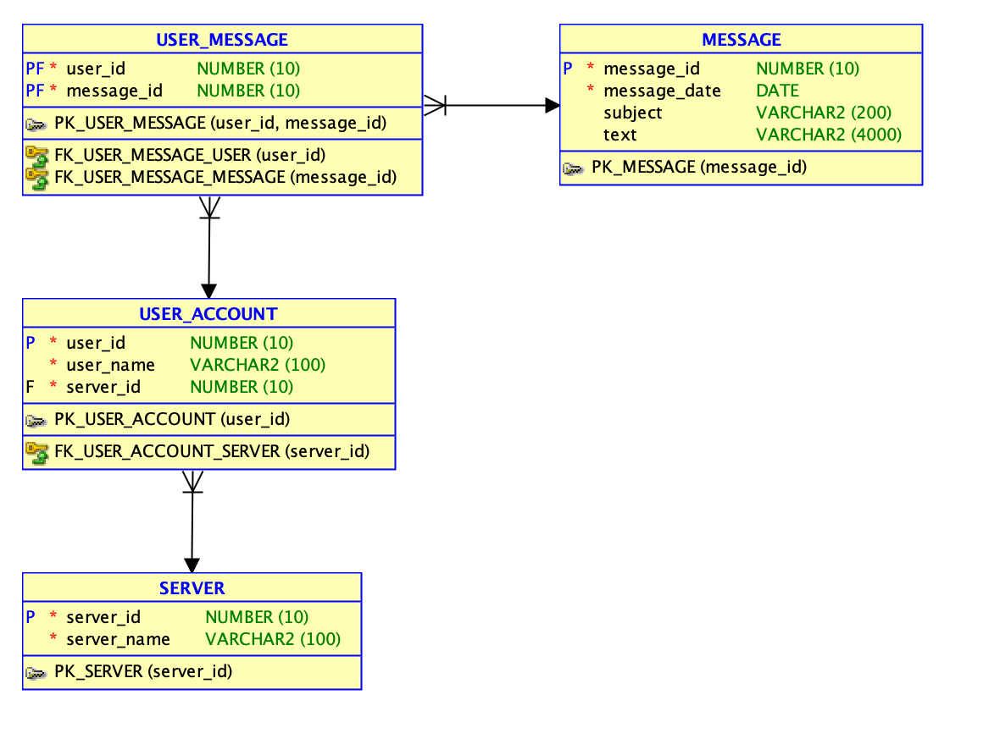

# Практическая работа №4. Преобразование к третьей нормальной форме

## 1. Оценка ненормализованных данных
Таблица `Messages` содержит повторяющиеся группы и смешивает данные о пользователях, сообщениях и серверах в одной структуре. Это приводит к избыточности:
- имя пользователя повторяется в каждой строке
- имя сервера повторяется в каждой строке
- одно и то же сообщение может встречаться у нескольких пользователей

## 2. Первая нормальная форма
В 1НФ каждый столбец атомарен, а строки уникальны.

### Таблица MESSAGE_LOG_1NF
- `user_id`
- `user_name`
- `message_id`
- `message_date`
- `subject`
- `text`
- `server_id`
- `server_name`

### Возможный первичный ключ
- составной PK: (`user_id`, `message_id`)

Такой ключ подходит, потому что один пользователь может иметь много сообщений, а одно и то же сообщение может быть связано с несколькими пользователями.

## 3. Вторая нормальная форма
Во 2НФ устраняются частичные зависимости от составного ключа.

### USER_2NF
- `user_id` PK
- `user_name`
- `server_id`
- `server_name`

### MESSAGE_2NF
- `message_id` PK
- `message_date`
- `subject`
- `text`

### USER_MESSAGE_2NF
- `user_id` PK, FK
- `message_id` PK, FK

Проблема еще остается в таблице `USER_2NF`: `server_name` зависит от `server_id`, а не от `user_id`.

## 4. Третья нормальная форма
В 3НФ устраняются транзитивные зависимости.

### SERVER
- `server_id` PK
- `server_name`

### USER_ACCOUNT
- `user_id` PK
- `user_name`
- `server_id` FK

### MESSAGE
- `message_id` PK
- `message_date`
- `subject`
- `text`

### USER_MESSAGE
- `user_id` PK, FK
- `message_id` PK, FK

## Итоговая ER-модель

