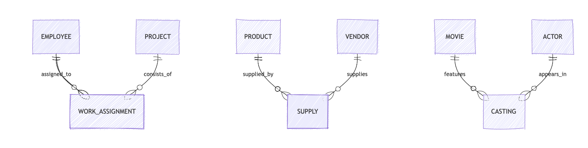
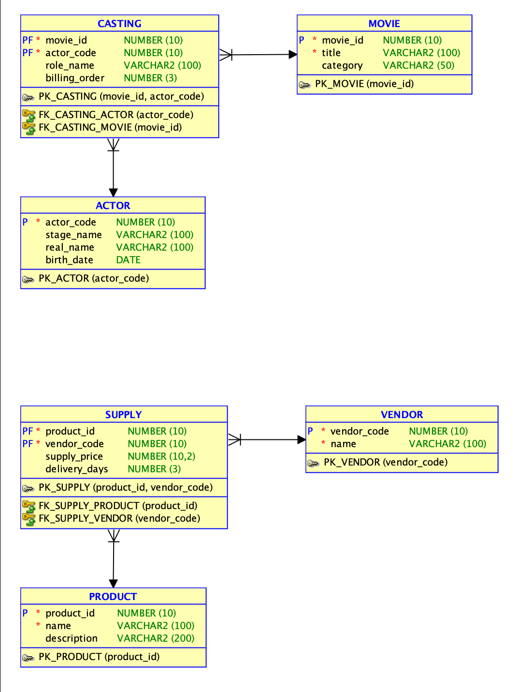
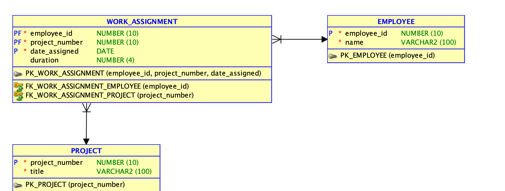

# Практическая работа №5. Преобразование отношений многие-ко-многим

## Пример 1. EMPLOYEE и PROJECT

### Исходное отношение
`EMPLOYEE M:N PROJECT`

### Новая сущность
`WORK_ASSIGNMENT`

### Итоговая модель
- `EMPLOYEE(employee_id PK, name)`
- `PROJECT(project_number PK, title)`
- `WORK_ASSIGNMENT(employee_id PK, FK, project_number PK, FK, date_assigned, duration)`

### Новые отношения
- `EMPLOYEE 1:M WORK_ASSIGNMENT`
- `PROJECT 1:M WORK_ASSIGNMENT`

## Пример 2. PRODUCT и VENDOR

### Исходное отношение
`PRODUCT M:N VENDOR`

### Новая сущность
`SUPPLY`

### Итоговая модель
- `PRODUCT(product_id PK, name, description)`
- `VENDOR(vendor_code PK, name)`
- `SUPPLY(product_id PK, FK, vendor_code PK, FK, supply_price, delivery_days)`

### Новые отношения
- `PRODUCT 1:M SUPPLY`
- `VENDOR 1:M SUPPLY`

## Пример 3. MOVIE и ACTOR

### Исходное отношение
`MOVIE M:N ACTOR`

### Новая сущность
`CASTING`

### Итоговая модель
- `MOVIE(movie_id PK, title, category)`
- `ACTOR(actor_code PK, stage_name, real_name, birth_date)`
- `CASTING(movie_id PK, FK, actor_code PK, FK, role_name, billing_order)`

### Новые отношения
- `MOVIE 1:M CASTING`
- `ACTOR 1:M CASTING`

## Сводная схема

