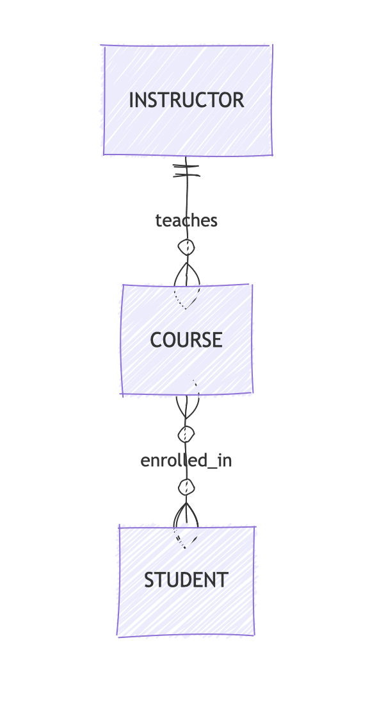
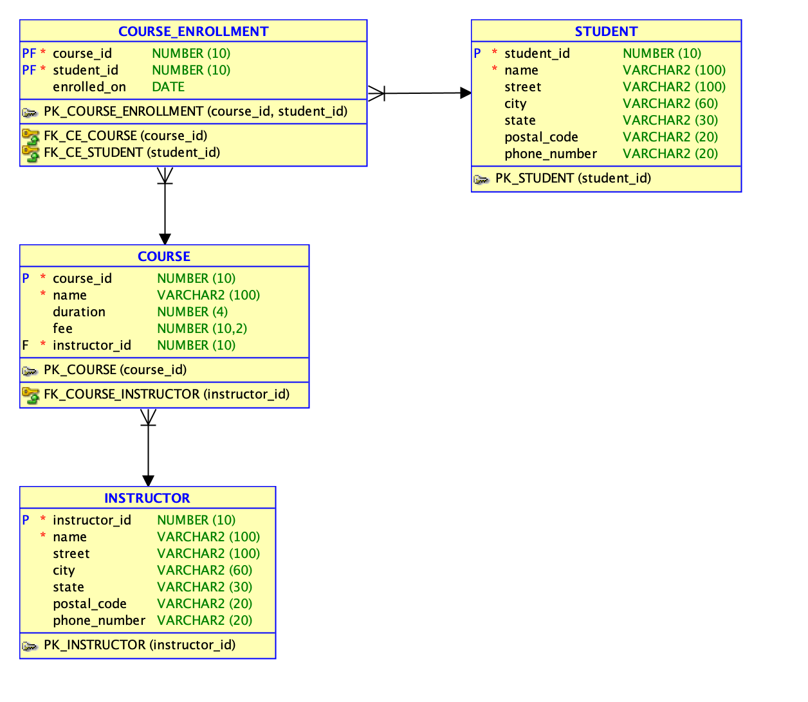
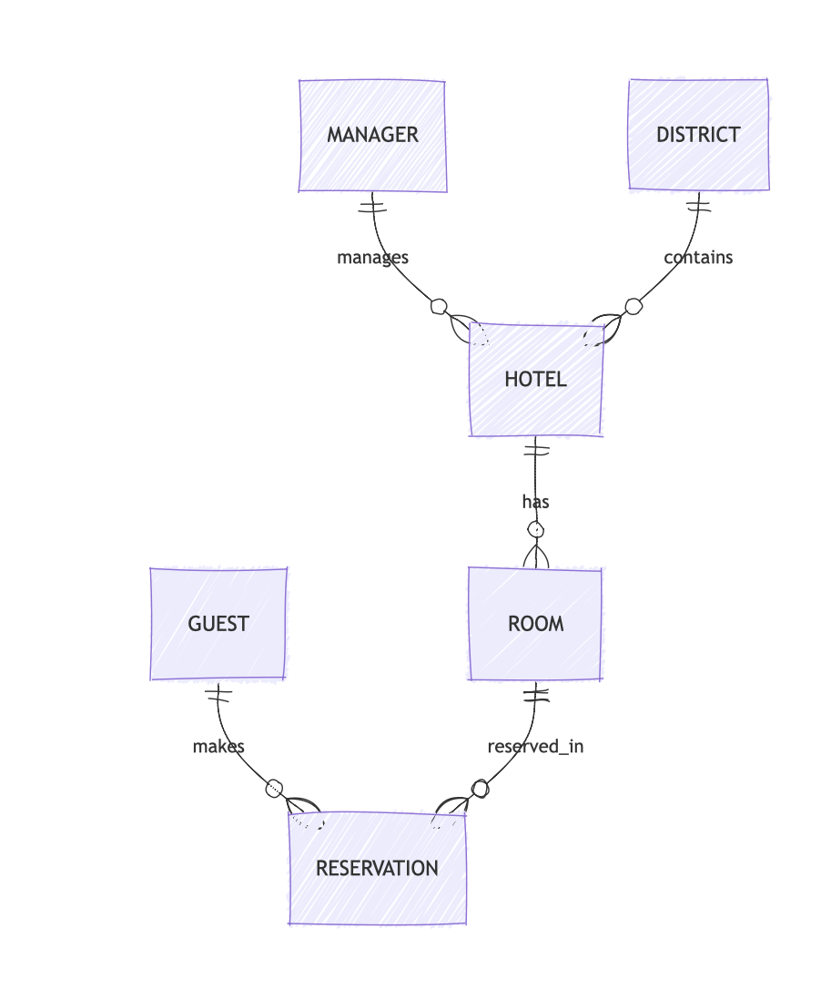
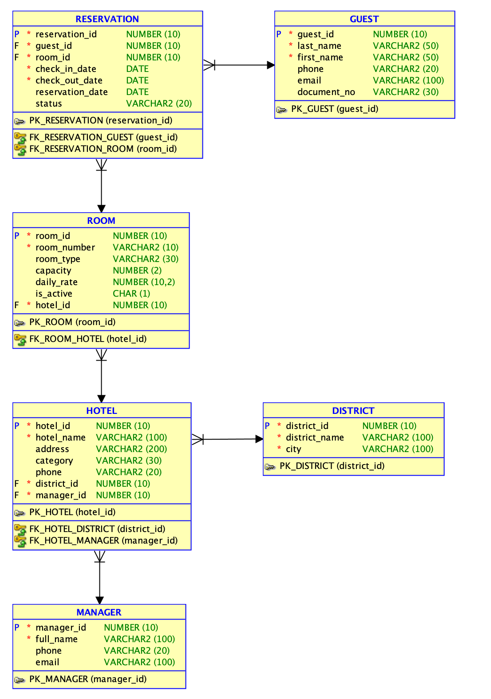

# Практическая работа №6. Построение модели в Oracle SQL Developer Data Modeler

## Результат упражнения 1
После выполнения шагов из задания должна получиться логическая модель из трех сущностей и двух связей.

### COURSE
- `Course Id` PK
- `Name`
- `Duration`
- `Fee`

### INSTRUCTOR
- `Instructor Id` PK
- `Name`
- `Street`
- `City`
- `State`
- `Postal Code`
- `Phone Number`

### STUDENT
- `Student Id` PK
- `Name`
- `Street`
- `City`
- `State`
- `Postal Code`
- `Phone Number`

### Связи
- `INSTRUCTOR 1:N COURSE`
  - имя на источнике: `teaches`
  - имя на цели: `taught by`
- `COURSE M:N STUDENT`
  - имя на источнике: `taken by`
  - имя на цели: `enrolled in`

## Схема результата

## Результат упражнения 2
Для пункта 44 в задании нужно построить собственную диаграмму для логической модели из практической работы №2. Ее можно оформить так:

