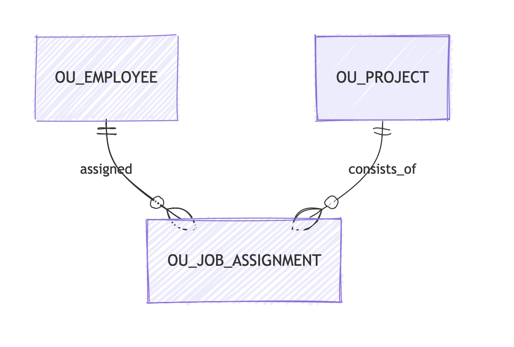

# Практическая работа №8. Создание реляционной модели

## Исходная логическая модель
По рисунку 1 заданы три сущности:
- `EMPLOYEE`
- `PROJECT`
- `JOB_ASSIGNMENT`

`JOB_ASSIGNMENT` является ассоциативной сущностью между `EMPLOYEE` и `PROJECT`.

## 1. Логическая модель

### EMPLOYEE
- `id` PK
- `name`

### PROJECT
- `number` PK
- `title`

### JOB_ASSIGNMENT
- `employee_id` PK, FK
- `project_number` PK, FK
- `date_assigned` PK
- `duration`

## 2. Проверка типов данных

| Объект | Атрибут | Тип данных |
|---|---|---|
| EMPLOYEE | `id` | `VARCHAR2(6)` |
| EMPLOYEE | `name` | `VARCHAR2(50)` |
| PROJECT | `number` | `VARCHAR2(6)` |
| PROJECT | `title` | `VARCHAR2(100)` |
| JOB_ASSIGNMENT | `employee_id` | `VARCHAR2(6)` |
| JOB_ASSIGNMENT | `project_number` | `VARCHAR2(6)` |
| JOB_ASSIGNMENT | `date_assigned` | `DATE` |
| JOB_ASSIGNMENT | `duration` | `NUMBER(4)` |

## 3. Глоссарий сокращений

| Полное имя | Сокращение |
|---|---|
| EMPLOYEE | EMP |
| PROJECT | PRJ |
| JOB_ASSIGNMENT | JOB_ASG |
| ID | ID |
| NAME | NM |
| NUMBER | NO |
| TITLE | TTL |
| DATE_ASSIGNED | DT_ASG |
| DURATION | DUR |

## 4. Краткие наименования и предпочтительные аббревиатуры
- `EMPLOYEE` -> краткое имя: Employee, аббревиатура: `EMP`
- `PROJECT` -> краткое имя: Project, аббревиатура: `PRJ`
- `JOB_ASSIGNMENT` -> краткое имя: Job Assignment, аббревиатура: `JOB_ASG`

## 5. Реляционная модель после преобразования

### OU_EMPLOYEE
- `employee_id` PK
- `name`

### OU_PROJECT
- `project_number` PK
- `title`

### OU_JOB_ASSIGNMENT
- `employee_id` PK, FK
- `project_number` PK, FK
- `date_assigned` PK
- `duration`

## 6. Имена ограничений
По условию суффиксы `PK` и `FK` нужно заменить на префиксы.

### Первичные ключи
- `PK_OU_EMPLOYEE`
- `PK_OU_PROJECT`
- `PK_OU_JOB_ASSIGNMENT`

### Внешние ключи
- `FK_OU_JOB_ASSIGNMENT_EMPLOYEE`
- `FK_OU_JOB_ASSIGNMENT_PROJECT`

## 7. Итоговая схема

