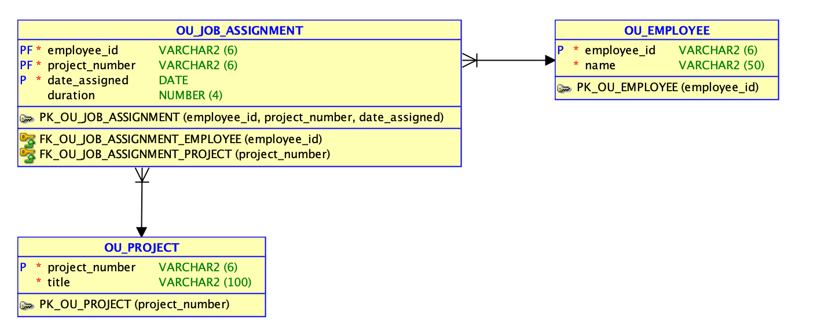

# Практическая работа №9. Создание SQL кода

## Решение
Для данной работы нужно сгенерировать SQL-скрипт развертывания реляционной модели в Oracle. Готовый пример скрипта сохранен отдельно в файле:

[`deploy_lab9.sql`](/Users/devijoe/Documents/ПРБД/solutions/deploy_lab9.sql)

## Что делает скрипт
- создает таблицы `OU_EMPLOYEE`, `OU_PROJECT`, `OU_JOB_ASSIGNMENT`
- задает первичные ключи с префиксом `PK_`
- задает внешние ключи с префиксом `FK_`
- использует структуру, подготовленную в практической работе №8

## Получившаяся схема
